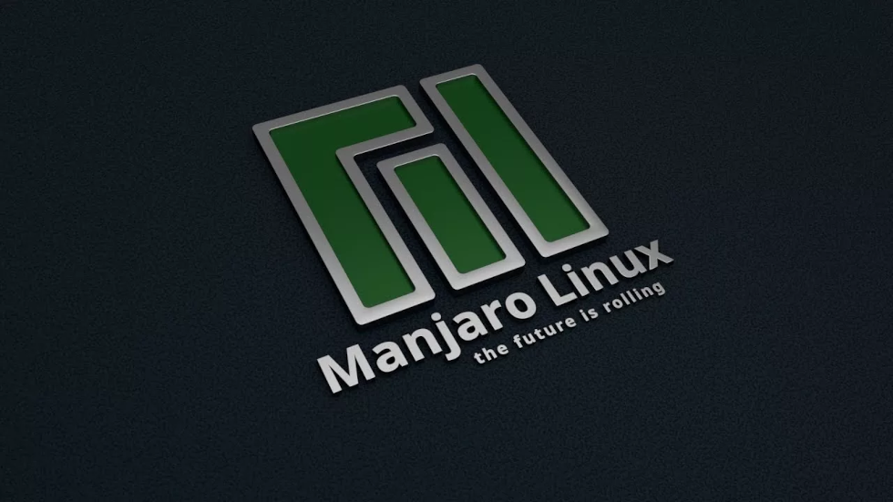

## WORKING TOOLS USED • ИСПОЛЬЗУЕМЫЙ РАБОЧИЙ ИНСТРУМЕНТАРИЙ

## SOFTWARE • ПРОГРАММНОЕ ОБЕСПЕЧЕНИЕ

Операционная система: Manjaro Linux + KDE Plasma
Веб-браузер: Chromium
Офисный пакет: OnlyOffice
Файловый менеджер: Double Commander

Растровый редактор: GIMP
Векторный редактор: Inkscape
Издательская система: Scribus
Редактор шрифтов: FontForge

3D-графика и моушн-дизайн: Blender
Редактор видеомонтажа: Kdenlive *
Звуковой редактор: Audacity
Цифровая звуковая рабочая станция: Ardour

Среда разработки и RAD-редактор: Qt
Компиляторы: GCC и Crosstool-NG для актуальной и старых версий ОС Linux и MinGW-w64 для ОС Windows

---

* [видеоредактор Davinci Resolve довольно затруднительно скачать, поддерживает далеко не все видеокарты
и слишком мало поддерживаемых кодеков](https://wiki.archlinux.org/title/DaVinci_Resolve#MP4,_H.264,_H.265_and_AAC_Support)

## AUXILIARY UTILITIES • ВСПОМОГАТЕЛЬНЫЕ УТИЛИТЫ

Издательство: PDF Mix Tool и PDFsam Basic *
Работа со шрифтами: Font Manager и Gucharmap
Программа для организации референсов: PureRef
Написание музыки: обёртка Windows-плагинов Yabridge
Контейнеры для ПО: AppImage для ОС Linux и Inno Setup для ОС Windows

Разработка: редактор шейдеров и скриптов Kate, система сборки CMake, кэш компиляции Ccache,
отладчик использования памяти AddressSanitizer, оверлей для мониторинга графики MangoHud,
Windows-рантайм для Линукса Wine, шестнадцатиричный редактор Okteta

Мультимедиа: программа для записи экрана Open Broadcaster Software,
аппаратный видеоконвертер HandBrake, видеопроигрыватель MPV и аудиоплеер Audacious

---

* редактор вёрстки Scribus не способен экспортировать PDF-издания
с объединением двухстраничных портретных разворотов в одну альбомную страницу

## БИБЛИОТЕКИ И API • LIBRARIES AND APIS

Платформенный код для ОС Linux и Windows: SDL
Графика: Vulkan + OpenGL Mathematics
Звук: OpenAL Soft + Ogg Vorbis
Видео: FFmpeg + dav1d (AV1) + Opus

Физика: Jolt Physics
Скриптовый язык: Lua
Компрессия игровых архивов: LZ4
Загрузка-сохранение настроек: inifile-cpp

Импорт-экспорт и оптимизация glTF-моделей: cglTF + Draco mesh + Mesh optimizer
Импорт-экспорт изображений: stb (JPEG, PNG, BMP, TGA, GIF, PSD, HDR, PIC и PNM)
Блочная компрессия текстурных карт: NVIDIA Texture Tools SDK

---

### © 2017-2026 Daniil Petrov • Даниил Петров

