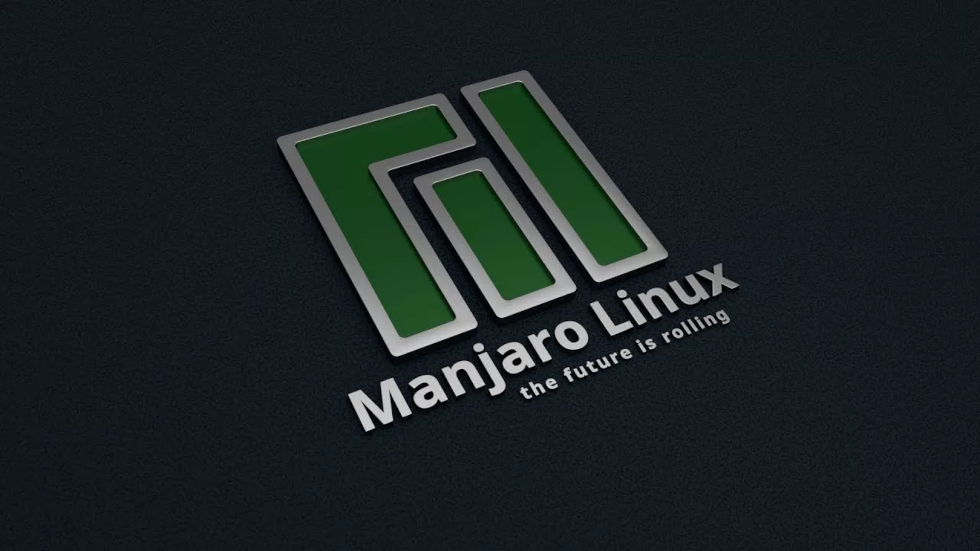
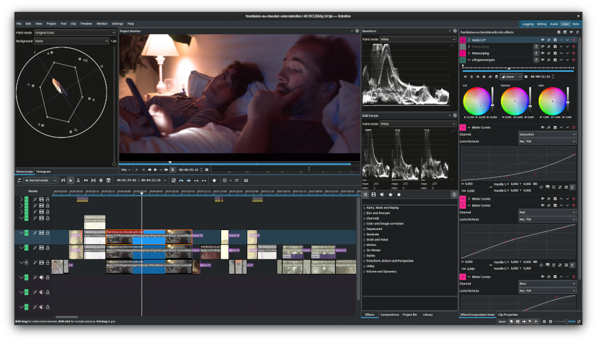
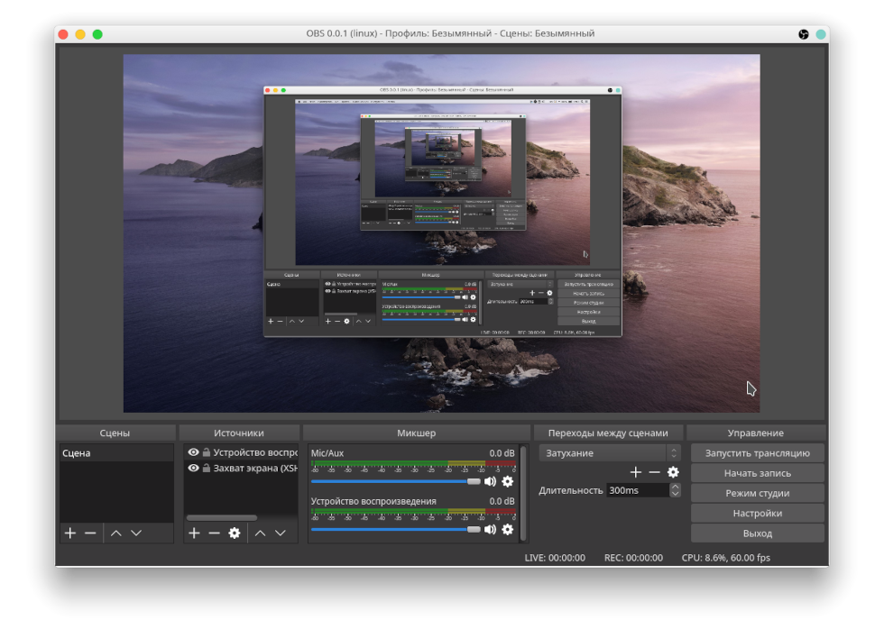

## WORKING TOOLS USED • ИСПОЛЬЗУЕМЫЙ РАБОЧИЙ ИНСТРУМЕНТАРИЙ

I have never been a proponent of russian software — let alone russian internet services — and have always considered myself an independent developer rather than a russian one; when runet finally degraded to cater to the uncompetitive «Gazprom-media», I deleted my russian-language blog and no longer wish to promote myself in Russia.

Я никогда не был сторонником ни российского программного обеспечения, ни тем более российских интернет-сервисов, и всегда считал себя не российским, а именно независимым разработчиком, а когда рунет окончательно деградировал в угоду неконкурентоспособному «Газпром-медиа», я удалил свой русскоязычный блог и больше не желаю продвигаться в России.

## SOFTWARE • ПРОГРАММНОЕ ОБЕСПЕЧЕНИЕ

* Operating system • Операционная система: [Manjaro Linux](https://manjaro.org/) + [KDE Plasma](https://kde.org/plasma-desktop/)
* Web browser • Веб-браузер: [Chromium](https://www.chromium.org/Home/)
* Office suite • Офисный пакет: [OnlyOffice](https://www.onlyoffice.com/)
* File manager • Файловый менеджер: [Double Commander](https://doublecmd.sourceforge.io/)

---

* Raster editor • Растровый редактор: [GIMP](https://www.gimp.org/)
* Vector editor • Векторный редактор: [Inkscape](https://inkscape.org/)
* Publishing system • Издательская система: [Scribus](https://www.scribus.net/)
* Font editor • Редактор шрифтов: [FontForge](https://fontforge.org/en-US/)

---

* 3D graphics and motion design • 3D-графика и моушн-дизайн: [Blender](https://www.blender.org/)
* Video editor • Редактор видеомонтажа: [Kdenlive](https://kdenlive.org/)*
* Sound editor • Звуковой редактор: [Audacity](https://www.audacityteam.org/)
* Digital audio workstation • Цифровая звуковая рабочая станция: [Ardour](https://ardour.org/)

---

* Development environment and RAD editor • Среда разработки и RAD-редактор: [Qt](https://www.qt.io/)
* Compilers: GCC and Crosstool-NG for current and older versions of Linux, and MinGW-w64 for Windows
* Компиляторы: GCC и Crosstool-NG для актуальной и старых версий ОС Linux и MinGW-w64 для ОС Windows

> [Davinci Resolve video editor is quite difficult to download, does not support all video cards, and has very few supported codecs](https://wiki.archlinux.org/title/DaVinci_Resolve#MP4,_H.264,_H.265_and_AAC_Support)

> [видеоредактор Davinci Resolve довольно затруднительно скачать, поддерживает далеко не все видеокарты и слишком мало поддерживаемых кодеков](https://wiki.archlinux.org/title/DaVinci_Resolve#MP4,_H.264,_H.265_and_AAC_Support)

## AUXILIARY UTILITIES • ВСПОМОГАТЕЛЬНЫЕ УТИЛИТЫ

* Publishing • Издательство: PDF Mix Tool + PDFsam Basic*
* Working with fonts • Работа со шрифтами: Font Manager + Gucharmap
* Reference Organization • Организации референсов: PureRef
* Music composition • Написание музыки: Windows plugins wrapper • обёртка Windows-плагинов Yabridge
* Software containers: AppImage for Linux and Inno Setup for Windows
* Контейнеры для ПО: AppImage для ОС Linux и Inno Setup для ОС Windows

---

* Development: Kate shader and script editor, CMake build system, Ccache compilation cache, AddressSanitizer memory error detector, MangoHud graphics monitoring overlay, Wine Windows runtime for Linux, Okteta hex editor

* Разработка: редактор шейдеров и скриптов Kate, система сборки CMake, кэш компиляции Ccache, отладчик использования памяти AddressSanitizer, оверлей для мониторинга графики MangoHud, Windows-рантайм для Линукса Wine, шестнадцатиричный редактор Okteta

---

* Multimedia: Open Broadcaster Software screen recording program, HandBrake hardware video converter, MPV video player, and Audacious audio player

* Мультимедиа: программа для записи экрана Open Broadcaster Software, аппаратный видеоконвертер HandBrake, видеопроигрыватель MPV и аудиоплеер Audacious

> Scribus, a page layout editor, is unable to export PDFs that combine two-page portrait spreads into a single landscape page

> редактор вёрстки Scribus не способен экспортировать PDF-издания с объединением двухстраничных портретных разворотов в одну альбомную страницу

## LIBRARIES AND APIS • БИБЛИОТЕКИ И API

* Platform-specific code for Linux and Windows • Платформенный код для ОС Linux и Windows: [SDL](https://www.libsdl.org/)
* Graphics • Графика: [Vulkan](https://vulkan.lunarg.com/sdk/home) + [OpenGL Mathematics](https://github.com/g-truc/glm)
* Sound • Звук: [OpenAL Soft](https://github.com/kcat/openal-soft) + [Ogg Vorbis](https://xiph.org/downloads/)

---

* Physics • Физика: [Jolt Physics](https://github.com/jrouwe/JoltPhysics)
* Scripting language • Скриптовый язык: [Lua](https://www.lua.org/download.html)
* Compression of game archives • Компрессия игровых архивов: [LZ4](https://github.com/lz4/lz4)
* Loading and saving settings • Загрузка-сохранение настроек: [inifile-cpp](https://github.com/Rookfighter/inifile-cpp)

---

* Model import/export and optimization • Импорт-экспорт и оптимизация моделей: [cglTF](https://github.com/jkuhlmann/cgltf) + [Draco mesh](https://github.com/google/draco) + [Mesh optimizer](https://github.com/zeux/meshoptimizer)
* Image import/export • Импорт-экспорт изображений: [stb](https://github.com/nothings/stb) (JPEG, PNG, BMP, TGA, GIF, PSD, HDR, PIC и PNM)
* Block compression of texture maps • Блочная компрессия текстурных карт: NVIDIA [Texture Tools SDK](https://developer.nvidia.com/gpu-accelerated-texture-compression)

---

### © 2017-2026 Daniil Petrov • Даниил Петров

